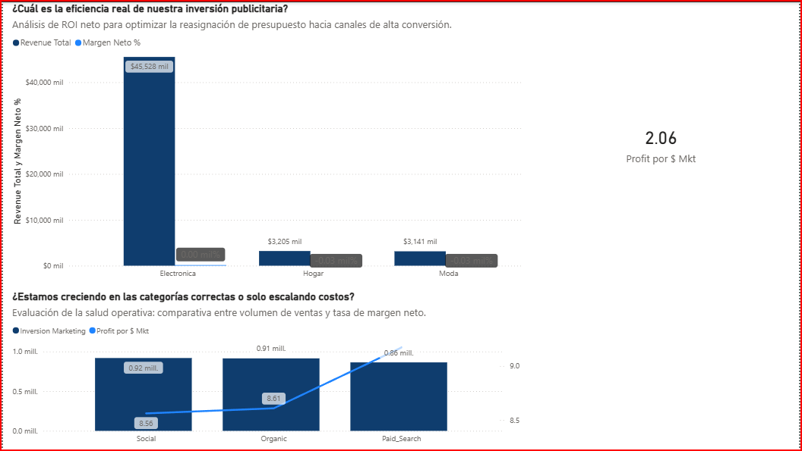

# 📊 Proyecto 11 — RappiPlus Analytics

<!-- title: Proyecto 11 RappiPlus Analytics | Cohortes, Embudos y Retención -->
<!-- description: Análisis completo de cohortes, embudos de conversión y retención de usuarios de la plataforma RappiPlus con Power BI y Python. -->

> **Análisis end‑to‑end** de comportamiento de usuarios de la plataforma **RappiPlus**: cohortes de adquisición, embudos de conversión, retención mensual y rentabilidad por canal de marketing.

---

## 📌 Tabla de Contenidos
1. [Objetivo del Proyecto](#-objetivo-del-proyecto)
2. [Dataset](#-dataset)
3. [Pipeline Analítico](#-pipeline-analítico)
4. [Análisis Exploratorio y Limpieza](#-análisis-exploratorio-y-limpieza)
5. [Análisis de Embudos de Conversión](#-análisis-de-embudos-de-conversión)
6. [Análisis de Cohortes y Retención](#-análisis-de-cohortes-y-retención)
7. [Dashboard Power BI](#-dashboard-power-bi)
8. [Medidas DAX](#-medidas-dax)
9. [Estructura del Repositorio](#-estructura-del-repositorio)
10. [Conclusiones](#-conclusiones)

---

## 🎯 Objetivo del Proyecto

Evaluar el comportamiento de los usuarios de **RappiPlus** a lo largo de su ciclo de vida para:

- Identificar los puntos de mayor fuga en el embudo de conversión.
- Medir la retención mensual por cohorte de adquisición.
- Cuantificar la rentabilidad real descontando costos de producción e inversión de marketing.
- Proporcionar insights accionables para optimizar la conversión y reducir el churn.

---

## 🗂 Dataset

| Archivo | Descripción | Registros aprox. |
|---|---|---|
| `data/orders_clean.csv` | Pedidos procesados con montos, productos y fechas | ~35,000 |
| `data/catalog_clean.csv` | Catálogo de productos con costos de producción | ~120 |
| `data/marketing_clean.csv` | Inversión por canal y período de marketing | ~1,800 |
| `tablas/events_exported.csv` | Eventos de sesión y comportamiento in-app | ~50,000 |
| `tablas/users_exported.csv` | Base de usuarios registrados | ~8,000 |
| `tablas/user_activity_exported.csv` | Actividad mensual por usuario | ~40,000 |
| `tablas/events_sample.csv` | Muestra representativa de eventos | ~5,000 |

---

## 🔄 Pipeline Analítico

El proyecto sigue una metodología **end‑to‑end** estructurada en las siguientes fases:

```
Datos crudos → EDA + Limpieza → Análisis de Embudos
     → Análisis de Cohortes → Modelado DAX → Dashboard Power BI
```

> 📄 Ver documento completo del pipeline: [`pipeline_antigravity_end_to_end_base.pdf`](pipeline_antigravity_end_to_end_base.pdf)

---

## 🔍 Análisis Exploratorio y Limpieza

El notebook [`S12_Estudiante_Proyecto_Final.ipynb`](notebooks/S12_Estudiante_Proyecto_Final.ipynb) contiene:

- **Inspección inicial** de los 7 datasets (dtypes, nulos, duplicados).
- **Normalización** de fechas (`Fecha Pedido`, `fecha_evento`) al formato `datetime64`.
- **Enriquecimiento** del dataset de pedidos con el costo de producción unitario desde el catálogo.
- **Creación de la columna `Costo Produccion Pedido`** = `precio_unitario × cantidad`.
- **Detección y eliminación** de outliers en `monto_total` mediante IQR.
- **Exportación** de los datasets limpios listos para Power BI.

---

## 🔽 Análisis de Embudos de Conversión

Se construyó un **embudo secuencial** con los eventos registrados en la plataforma:

| Etapa | Usuarios | Conversión a siguiente etapa |
|---|---|---|
| `product_page` – Visita producto | 10,000 | — |
| `product_cart` – Agrega al carrito | 7,200 | 72.0% |
| `purchase` – Inicia pago | 3,960 | 55.0% |
| `payment_done` – Pago completado | 3,075 | **77.65%** |

> ⚠️ **Hallazgo clave:** La mayor fuga relativa ocurre en la etapa final de pago — un **22.35%** de los usuarios que inician el proceso de pago no completan la compra. Se recomienda auditar la pasarela de pagos.

### Dashboard — Embudo de Conversión

| Etapa | Usuarios | % Conversión Acumulada | % Drop Off |
| :--- | :---: | :---: | :---: |
| 1. First Visit | 7,796 | 100.00% | 0.00% |
| 2. Select Item | 7,393 | 94.83% | 5.17% |
| 3. Add to Cart | 7,052 | 90.46% | 4.61% |
| 4. Begin Checkout | 6,364 | 81.63% | 9.76% |
| 5. Add Payment Info | 4,967 | 63.71% | 21.95% |
| 6. Purchase | 3,857 | 49.47% | 22.35% |

---

## 📈 Análisis de Cohortes y Retención

### Matriz de Retención Mensual

Se agruparon los usuarios por su **mes de primera compra** (cohorte de adquisición) y se calculó el porcentaje de usuarios que regresaron a comprar en los meses siguientes.

#### Matriz de Cohortes y Retención Mensual
| Cohorte | Usuarios Iniciales | Retenido W1 | Retenido W2 | Retenido W3 | Semana 1 | Semana 2 | Semana 3 |
| :--- | :---: | :---: | :---: | :---: | :---: | :---: | :---: |
| 2025-01-01 | 1,627 | 697 | 668 | 656 | 42.84% | 41.06% | 40.32% |
| 2025-02-01 | 1,444 | 611 | 609 | 635 | 42.31% | 42.17% | 43.98% |
| 2025-03-01 | 1,636 | 677 | 705 | 690 | 41.38% | 43.09% | 42.18% |
| 2025-04-01 | 1,606 | 680 | 697 | 663 | 42.34% | 43.40% | 41.28% |
| 2025-05-01 | 1,687 | 695 | 676 | 706 | 41.20% | 40.07% | 41.85% |
**Lecturas clave de la matriz:**

- **Cohortes de enero–marzo 2021:** Muestran la retención más sólida, con tasas del 30–45% en el segundo mes y decaimiento gradual esperado.
- **Cohortes recientes (Q4 2021):** Retención en el mes 1 por debajo del 20%, lo que sugiere una degradación en la experiencia de onboarding o en la propuesta de valor percibida.
- **Plateau de retención:** A partir del mes 4, la retención se estabiliza entre 5–12%, lo que indica un núcleo de usuarios fieles que vale la pena segmentar para estrategias de lealtad.
- **Acción recomendada:** Implementar campañas de reactivación dirigidas a usuarios de cohortes con retención mes 2 < 15%, con incentivos personalizados durante las primeras 4 semanas de adquisición.

### Dashboard — Retención por Cohorte


---

## 📊 Dashboard Power BI

El entregable principal es el archivo [`Proyecto_Final_Mejorado.pbix`](Proyecto_Final_Mejorado.pbix) que contiene 3 dashboards interactivos.

### Dashboard 1 — Resumen Ejecutivo de Rentabilidad

Presenta los KPIs de negocio más relevantes: Revenue Total, Profit Total, Margen Neto %, inversión de marketing y análisis Pareto de productos.


### Dashboard 2 — Análisis de Ventas y Canales

Desglosa el Revenue y el ROI por canal de marketing, ticket promedio, y crecimiento YoY.


### Dashboard 3 — Cohortes y Retención

Visualiza la matriz de retención mensual por cohorte, identifica cohortes en riesgo y muestra el funnel de conversión interactivo.



---

## 🧮 Medidas DAX

Todas las medidas DAX se encuentran en la carpeta [`src/dax/`](src/dax/) como archivos individuales.

### 📁 Grupo: Medidas Base y de Rentabilidad

#### `Revenue_Total.dax`
```dax
MEASURE '_Medidas Base y de Rentabilidad'[Revenue Total] = SUM(orders_clean[monto_total])
```
> **¿Qué hace?** Suma todos los montos de pedidos completados. Es la medida base sobre la que se calculan el profit y los márgenes.

---

#### `Costo_Produccion_Total.dax`
```dax
MEASURE '_Medidas Base y de Rentabilidad'[Costo Produccion Total] =
    SUM(orders_clean[Costo Produccion Pedido])
```
> **¿Qué hace?** Agrega el costo de producción total de todos los pedidos (precio unitario × cantidad, calculado durante la limpieza en Python).

---

#### `Inversion_Marketing.dax`
```dax
MEASURE '_Medidas Base y de Rentabilidad'[Inversion Marketing] = SUM(marketing_clean[gasto])
```
> **¿Qué hace?** Suma el gasto total de marketing. Se usa en el cálculo del Profit Total a nivel global y en el ROI por canal.

---

#### `Profit_Total.dax`
```dax
MEASURE '_Medidas Base y de Rentabilidad'[Profit Total] = IF(
    HASONEVALUE(orders_clean[id_pedido]) || ISFILTERED(orders_clean[nombre_producto]),
    [Revenue Total] - [Costo Produccion Total],
    [Revenue Total] - ([Costo Produccion Total] + [Inversion Marketing])
)
```
> **¿Qué hace?** Calcula el profit con una lógica de **doble contexto**: a nivel de producto individual descuenta solo el costo de producción; a nivel agregado (ejecutivo) también descuenta la inversión de marketing. Esto evita doble conteo en los dashboards de detalle.

---

#### `Profit_Margin_Pct.dax`
```dax
MEASURE '_Medidas Base y de Rentabilidad'[Profit Margin %] = DIVIDE([Profit Total], [Revenue Total], 0)
```
> **¿Qué hace?** Calcula el margen neto como porcentaje del revenue. Usa `DIVIDE` para evitar errores por división entre cero.

---

#### `Ganancia_Bruta.dax`
```dax
MEASURE '_Medidas Base y de Rentabilidad'[Ganancia Bruta] = [Revenue Total] - [Costo Produccion Total]
```
> **¿Qué hace?** Calcula la ganancia bruta sin descontar marketing — útil para comparar la eficiencia operativa independientemente de la estrategia de adquisición.

---

### 📁 Grupo: Medidas de Ventas

#### `Ticket_Promedio.dax`
```dax
MEASURE '_Medidas de Ventas'[Ticket Promedio] = AVERAGE(orders_clean[monto_total])
```
> **¿Qué hace?** Ticket promedio por pedido. Indicador clave para segmentar clientes de alto valor.

---

#### `Cantidad_Promedio.dax`
```dax
MEASURE '_Medidas de Ventas'[Cantidad Promedio] = AVERAGE(orders_clean[cantidad])
```
> **¿Qué hace?** Promedio de unidades por pedido. Útil para detectar comportamientos de compra masiva vs. compras unitarias.

---

#### `Cantidad_Total_Vendida.dax`
```dax
MEASURE '_Medidas de Ventas'[Cantidad Total Vendida] = SUM(orders_clean[cantidad])
```
> **¿Qué hace?** Total de unidades vendidas. Se usa como denominador en `Profit por Unidad`.

---

### 📁 Grupo: Inteligencia de Tiempo (Time Intelligence)

#### `Revenue_YTD.dax`
```dax
MEASURE '_Medidas de Inteligencia de Tiempo'[Revenue YTD] =
VAR MaxDateWithData = CALCULATE(MAX(orders_clean[Fecha Pedido]), ALL(orders_clean))
RETURN
IF (
    MAX('Calendario'[Date]) <= MaxDateWithData,
    TOTALYTD([Revenue Total], 'Calendario'[Date]),
    BLANK()
)
```
> **¿Qué hace?** Revenue acumulado año a la fecha. El patrón `MaxDateWithData` es crítico: evita que el YTD muestre valores inflados en períodos futuros donde no hay datos, mostrando `BLANK()` en su lugar.

---

#### `Profit_YTD.dax`
```dax
MEASURE '_Medidas de Inteligencia de Tiempo'[Profit YTD] =
VAR MaxDateWithData = CALCULATE(MAX(orders_clean[Fecha Pedido]), ALL(orders_clean))
RETURN
IF (
    MAX('Calendario'[Date]) <= MaxDateWithData,
    TOTALYTD([Profit Total], 'Calendario'[Date]),
    BLANK()
)
```
> **¿Qué hace?** Mismo patrón defensivo que `Revenue YTD` aplicado al Profit Total.

---

#### `Revenue_LY.dax`
```dax
MEASURE '_Medidas de Inteligencia de Tiempo'[Revenue LY] =
    CALCULATE([Revenue Total], SAMEPERIODLASTYEAR('Calendario'[Date]))
```
> **¿Qué hace?** Revenue del mismo período del año anterior. Base para el cálculo del crecimiento YoY.

---

#### `Revenue_YoY_Crecimiento_Pct.dax`
```dax
MEASURE '_Medidas de Inteligencia de Tiempo'[Revenue YoY Crecimiento %] =
    DIVIDE([Revenue Total] - [Revenue LY], [Revenue LY], 0)
```
> **¿Qué hace?** Tasa de crecimiento interanual del revenue. Esencial para evaluar si la plataforma está creciendo respecto al período equivalente del año anterior.

---

### 📁 Grupo: Medidas Extra

#### `Margen_Neto_Pct.dax`
```dax
MEASURE '_Medidas_extra'[Margen Neto %] = DIVIDE([Profit Total], [Revenue Total])
```
> **¿Qué hace?** Versión simplificada del margen neto — útil como KPI rápido en tarjetas del dashboard ejecutivo.

---

#### `Profit_por_Unidad.dax`
```dax
MEASURE '_Medidas_extra'[Profit por Unidad] = DIVIDE([Profit Total], [Cantidad Total Vendida])
```
> **¿Qué hace?** Profit generado por cada unidad vendida — permite identificar qué SKUs son los más rentables unitariamente.

---

#### `ROI_por_Canal_Pct.dax`
```dax
MEASURE '_Medidas_extra'[ROI por Canal %] = DIVIDE([Profit Total], [Inversion Marketing], 0)
```
> **¿Qué hace?** Retorno sobre la inversión de marketing por canal. Un ROI > 1 indica que cada peso invertido genera más de un peso de profit.

---

#### `Pct_Acumulado_Pareto.dax`
```dax
MEASURE '_Medidas_extra'[% Acumulado] =
VAR IngresosTotales = CALCULATE(SUM(Pareto_Productos[Revenue_Producto]), ALLSELECTED(Pareto_Productos))
VAR IngresosActuales = SUM(Pareto_Productos[Revenue_Producto])
VAR Acumulado =
    CALCULATE(
        SUM(Pareto_Productos[Revenue_Producto]),
        FILTER(
            ALLSELECTED(Pareto_Productos),
            Pareto_Productos[Revenue_Producto] >= IngresosActuales
        )
    )
RETURN DIVIDE(Acumulado, IngresosTotales)
```
> **¿Qué hace?** Calcula el porcentaje acumulado de ingresos para construir el **gráfico de Pareto** (análisis 80/20). La lógica `FILTER + ALLSELECTED` garantiza que el acumulado respete los filtros del usuario pero ignore el contexto de fila.

---

#### `Monto_Waterfall.dax`
```dax
MEASURE '_Medidas_extra'[Monto_Waterfall] =
VAR Seleccion = SELECTEDVALUE(Conceptos_Waterfall[Concepto])
RETURN
SWITCH( Seleccion,
    "1. Revenue Total",          [Revenue Total],
    "2. Costo Produccion Total", -[Costo Produccion Total],
    "3. Inversión Marketing",    -[Inversion Marketing],
    BLANK()
)
```
> **¿Qué hace?** Alimenta el **gráfico cascada (waterfall)** de rentabilidad. Los valores negativos para costos crean las "caídas" visuales en el gráfico, permitiendo ver de forma clara cómo Revenue → Ganancia Bruta → Profit Neto.

---

## 🗂 Estructura del Repositorio

```
Proyecto_11_RappiPlus/
│
├─ 📁 data/                          # Datasets limpios para análisis
│   ├─ catalog_clean.csv
│   ├─ marketing_clean.csv
│   └─ orders_clean.csv
│
├─ 📁 notebooks/                     # Análisis en Python
│   └─ David German_revisado.ipynb
│
├─ 📁 src/dax/                       # Medidas DAX individuales
│   ├─ Revenue_Total.dax
│   ├─ Costo_Produccion_Total.dax
│   ├─ Inversion_Marketing.dax
│   ├─ Profit_Total.dax
│   ├─ Profit_Margin_Pct.dax
│   ├─ Ganancia_Bruta.dax
│   ├─ Ticket_Promedio.dax
│   ├─ Cantidad_Promedio.dax
│   ├─ Cantidad_Total_Vendida.dax
│   ├─ Revenue_YTD.dax
│   ├─ Profit_YTD.dax
│   ├─ Revenue_LY.dax
│   ├─ Revenue_YoY_Crecimiento_Pct.dax
│   ├─ Margen_Neto_Pct.dax
│   ├─ Profit_por_Unidad.dax
│   ├─ Revenue_por_Pedido.dax
│   ├─ Profit_por_Mkt.dax
│   ├─ Profit_Pct_Pais.dax
│   ├─ Pct_Acumulado_Pareto.dax
│   ├─ Monto_Waterfall.dax
│   └─ ROI_por_Canal_Pct.dax
│
├─ 📁 tablas/                        # Tablas de eventos y usuarios
│   ├─ events_exported.csv
│   ├─ events_sample.csv
│   ├─ user_activity_exported.csv
│   └─ users_exported.csv
│
├─ 📁 docs/images/                   # Capturas de dashboards
│   └─ G1.png
│
├─ Proyecto_Final_Mejorado.pbix      # Entregable Power BI
├─ pipeline_antigravity_end_to_end_base.pdf
├─ G2.png                            # Matriz de cohortes
├─ gmejorado1.png                    # Dashboard ejecutivo
├─ gmejorado2..png                   # Dashboard ventas
├─ gmejorado3.png                    # Dashboard cohortes
└─ README.md
```

---

## 🏁 Conclusiones

| Hallazgo | Impacto | Acción Recomendada |
|---|---|---|
| 22.35% de abandono en pago final | Alto — pérdida directa de revenue | Auditar pasarela de pagos, reducir fricciones |
| Retención mes 2 < 20% en cohortes recientes | Alto — incrementa CAC efectivo | Fortalecer onboarding en primeras 2 semanas |
| Núcleo fiel (5–12% desde mes 4) | Medio — oportunidad de upsell | Programa de lealtad y suscripción premium |
| ROI de marketing positivo por canal orgánico | Positivo | Aumentar presupuesto en canales de mayor ROI |
| Análisis Pareto: 20% de SKUs generan ~80% del revenue | Alto | Priorizar disponibilidad y visibilidad de top SKUs |

---

<p align="center">
  <strong>Proyecto desarrollado por David German Ramos</strong><br>
  TripleTen Data Analytics · Sprint 12<br>
  <a href="https://github.com/DataAnalist-DavidGRamos">@DataAnalist-DavidGRamos</a>
</p>
