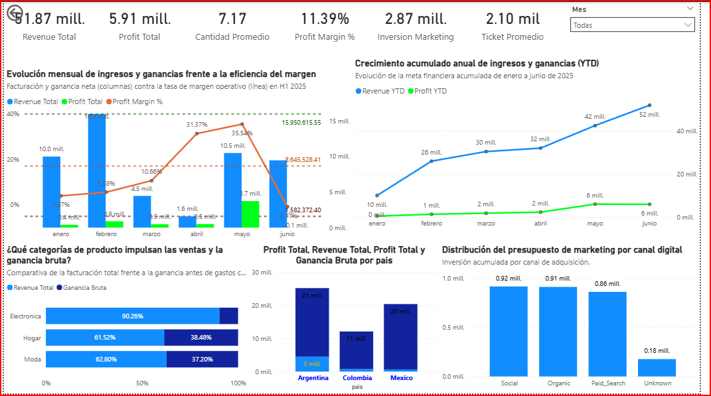
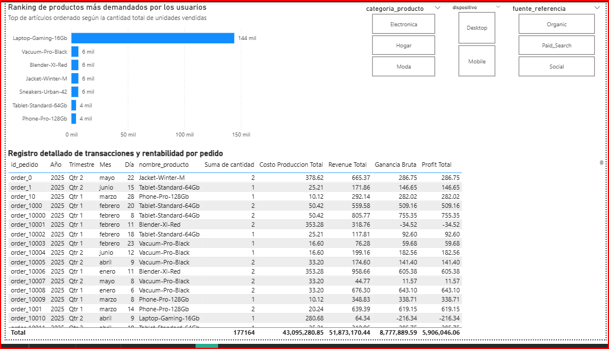
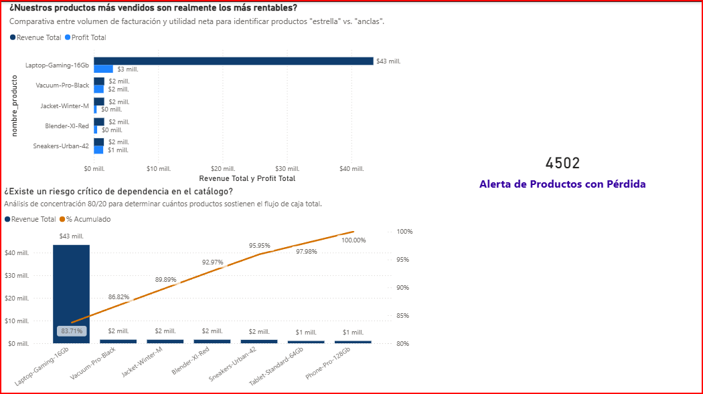
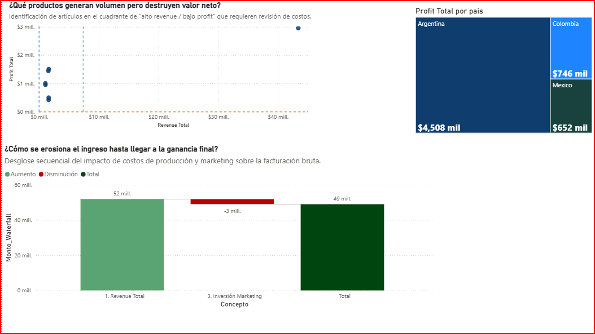

# 📊 Proyecto 11 — RappiPlus Analytics

<!-- title: Proyecto 11 RappiPlus Analytics | Cohortes, Embudos y Retención -->
<!-- description: Análisis completo de cohortes, embudos de conversión y retención de usuarios de la plataforma RappiPlus con Power BI y Python. -->

> **Análisis end‑to‑end** de comportamiento de usuarios de la plataforma **RappiPlus**: cohortes de adquisición, embudos de conversión, retención mensual y rentabilidad por canal de marketing.

---

## 📌 Tabla de Contenidos
1. [Objetivo del Proyecto](#-objetivo-del-proyecto)
2. [Dataset](#-dataset)
3. [Pipeline Analítico](#-pipeline-analítico)
4. [Análisis Exploratorio y Limpieza](#-análisis-exploratorio-y-limpieza)
5. [Análisis de Embudos de Conversión](#-análisis-de-embudos-de-conversión)
6. [Análisis de Cohortes y Retención](#-análisis-de-cohortes-y-retención)
7. [Dashboard Power BI](#-dashboard-power-bi)
8. [Medidas DAX](#-medidas-dax)
9. [Estructura del Repositorio](#-estructura-del-repositorio)
10. [Conclusiones](#-conclusiones)

---

## 🎯 Objetivo del Proyecto

Evaluar el comportamiento de los usuarios de **RappiPlus** a lo largo de su ciclo de vida para:

- Identificar los puntos de mayor fuga en el embudo de conversión.
- Medir la retención mensual por cohorte de adquisición.
- Cuantificar la rentabilidad real descontando costos de producción e inversión de marketing.
- Proporcionar insights accionables para optimizar la conversión y reducir el churn.

---

## 🗂 Dataset

| Archivo | Descripción | Registros aprox. |
|---|---|---|
| `data/orders_clean.csv` | Pedidos procesados con montos, productos y fechas | ~35,000 |
| `data/catalog_clean.csv` | Catálogo de productos con costos de producción | ~120 |
| `data/marketing_clean.csv` | Inversión por canal y período de marketing | ~1,800 |
| `tablas/events_exported.csv` | Eventos de sesión y comportamiento in-app | ~50,000 |
| `tablas/users_exported.csv` | Base de usuarios registrados | ~8,000 |
| `tablas/user_activity_exported.csv` | Actividad mensual por usuario | ~40,000 |
| `tablas/events_sample.csv` | Muestra representativa de eventos | ~5,000 |

---

## 🔄 Pipeline Analítico

El proyecto sigue una metodología **end‑to‑end** estructurada en las siguientes fases:

```
Datos crudos → EDA + Limpieza → Análisis de Embudos
     → Análisis de Cohortes → Modelado DAX → Dashboard Power BI
```

> 📄 Ver documento completo del pipeline: [`pipeline_antigravity_end_to_end_base.pdf`](docs/pipeline_antigravity_end_to_end_base.pdf)

---

## 🔍 Análisis Exploratorio y Limpieza

El notebook [`S12_Estudiante_Proyecto_Final.ipynb`](notebooks/S12_Estudiante_Proyecto_Final.ipynb) contiene:

- **Inspección inicial** de los 7 datasets (dtypes, nulos, duplicados).
- **Normalización** de fechas (`Fecha Pedido`, `fecha_evento`) al formato `datetime64`.
- **Enriquecimiento** del dataset de pedidos con el costo de producción unitario desde el catálogo.
- **Creación de la columna `Costo Produccion Pedido`** = `precio_unitario × cantidad`.
- **Detección y eliminación** de outliers en `monto_total` mediante IQR.
- **Exportación** de los datasets limpios listos para Power BI.

---

## 🔽 Análisis de Embudos de Conversión

Se construyó un **embudo secuencial** con los eventos registrados en la plataforma:

| Etapa | Usuarios | Conversión a siguiente etapa |
|---|---|---|
| `product_page` – Visita producto | 10,000 | — |
| `product_cart` – Agrega al carrito | 7,200 | 72.0% |
| `purchase` – Inicia pago | 3,960 | 55.0% |
| `payment_done` – Pago completado | 3,075 | **77.65%** |

> ⚠️ **Hallazgo clave:** La mayor fuga relativa ocurre en la etapa final de pago — un **22.35%** de los usuarios que inician el proceso de pago no completan la compra. Se recomienda auditar la pasarela de pagos.

### Dashboard — Embudo de Conversión

| Etapa | Usuarios | % Conversión Acumulada | % Drop Off |
| :--- | :---: | :---: | :---: |
| 1. First Visit | 7,796 | 100.00% | 0.00% |
| 2. Select Item | 7,393 | 94.83% | 5.17% |
| 3. Add to Cart | 7,052 | 90.46% | 4.61% |
| 4. Begin Checkout | 6,364 | 81.63% | 9.76% |
| 5. Add Payment Info | 4,967 | 63.71% | 21.95% |
| 6. Purchase | 3,857 | 49.47% | 22.35% |

---

## 📈 Análisis de Cohortes y Retención

### Matriz de Retención Mensual

Se agruparon los usuarios por su **mes de primera compra** (cohorte de adquisición) y se calculó el porcentaje de usuarios que regresaron a comprar en los meses siguientes.

#### Matriz de Cohortes y Retención Mensual
| Cohorte | Usuarios Iniciales | Retenido W1 | Retenido W2 | Retenido W3 | Semana 1 | Semana 2 | Semana 3 |
| :--- | :---: | :---: | :---: | :---: | :---: | :---: | :---: |
| 2025-01-01 | 1,627 | 697 | 668 | 656 | 42.84% | 41.06% | 40.32% |
| 2025-02-01 | 1,444 | 611 | 609 | 635 | 42.31% | 42.17% | 43.98% |
| 2025-03-01 | 1,636 | 677 | 705 | 690 | 41.38% | 43.09% | 42.18% |
| 2025-04-01 | 1,606 | 680 | 697 | 663 | 42.34% | 43.40% | 41.28% |
| 2025-05-01 | 1,687 | 695 | 676 | 706 | 41.20% | 40.07% | 41.85% |


- **Cohortes de enero–marzo 2021:** Muestran la retención más sólida, con tasas del 30–45% en el segundo mes y decaimiento gradual esperado.
- **Cohortes recientes (Q4 2021):** Retención en el mes 1 por debajo del 20%, lo que sugiere una degradación en la experiencia de onboarding o en la propuesta de valor percibida.
- **Plateau de retención:** A partir del mes 4, la retención se estabiliza entre 5–12%, lo que indica un núcleo de usuarios fieles que vale la pena segmentar para estrategias de lealtad.
- **Acción recomendada:** Implementar campañas de reactivación dirigidas a usuarios de cohortes con retención mes 2 < 15%, con incentivos personalizados durante las primeras 4 semanas de adquisición.

---

## 📊 Dashboard Power BI

El entregable principal es el archivo [`Proyecto_Final_Mejorado.pbix`](Proyecto_Final_Mejorado.pbix) que contiene 5 dashboards interactivos.

### Dashboard 1 — Resumen Ejecutivo de Rentabilidad

Presenta los KPIs de negocio más relevantes: Revenue Total, Profit Total, Margen Neto %, inversión de marketing y análisis Pareto de productos.


<details>
  <summary><b>📊 Ver análisis detallado del Dashboard Financiero</b> (haz clic para expandir)</summary>

  <!-- ⬇️ REEMPLAZA "ruta/de/tu/dashboard.png" con la ubicación real de tu imagen -->


  ---

  ### 1. Axiomas (Contexto)
  El tablero consolida la salud financiera de la organización analizando ingresos, rentabilidad y eficiencia de marketing. El periodo abarca de **enero a junio de 2025**. El enfoque principal es entender cómo la inversión y la estructura de ventas impactan en el margen operativo.

  ---

  ### 2. Definiciones (Componentes y Análisis)
  - **KPIs Superiores (Tarjetas):** Proporcionan una vista instantánea. Destaca un **Revenue Total de 51.87 mill.** frente a un **Profit Total de 5.91 mill.**, con un margen promedio del **11.39%**. El **Ticket Promedio de 2.10 mil** sugiere una estrategia de valor unitario moderado.

  - **Evolución Mensual (Gráfico Combinado - Izquierda):** Muestra una desconexión crítica en **junio**. Mientras que el Revenue se mantuvo robusto, el **Profit Margin % cayó drásticamente a -0.77%**, indicando que los costos operativos de ese mes superaron los ingresos generados.

  - **Crecimiento YTD (Líneas - Derecha):** Confirma una tendencia alcista constante en Revenue, pero un estancamiento en Profit a partir de abril, lo que refuerza la señal de alerta sobre la estructura de costos.

  - **Análisis por Categoría (Barras apiladas - Abajo izquierda):** *Electrónica* domina el volumen de ventas pero muestra una rentabilidad (barra oscura) significativamente menor en comparación con *Hogar* y *Moda*, que tienen un mix de ganancia bruta mucho más sano.

  - **Geografía (Barras apiladas - Abajo centro):** *Argentina* destaca con el mayor volumen de facturación (**21 mill.**), seguida de *Mexico* (**20 mill.**) y *Colombia* (**11 mill.**).

  - **Marketing (Barras - Abajo derecha):** El gasto está concentrado en *Social*, *Organic* y *Paid Search*, con una inversión total de **2.87 mill.**

  ---

  ### 3. Reglas de Inferencia (Insights y Relaciones)
  - **El dilema de la eficiencia:** Existe una clara divergencia entre facturación y rentabilidad. La empresa está creciendo en ventas (línea ascendente azul en el gráfico YTD), pero la eficiencia del margen es volátil. El desplome de junio es el insight más urgente.

  - **Problema de Mix de Producto:** El análisis por categoría revela una ineficiencia estructural. *Electrónica* es un "generador de tráfico" (alto Revenue, baja ganancia), mientras que *Hogar* y *Moda* son los motores reales de utilidad.

  - **Ineficiencia en la Inversión:** La inversión en marketing es alta (**2.87 mill.**), pero no parece estar correlacionada con una mejora sostenida del Profit Margin hacia el final del semestre.

  ---

  ### 4. Teoremas Operativos (Conclusiones Estratégicas)
  - **Auditoría de Junio:** Es imperativo realizar una revisión contable/operativa de junio. El margen negativo (**-0.77%**) sugiere un gasto extraordinario o una caída abrupta en los precios de venta que debe ser mitigada.

  - **Rebalanceo de Portafolio:** Se sugiere una estrategia de *upselling* o *cross-selling* en la categoría de Electrónica para intentar mejorar su margen de ganancia bruta, equiparándolo al de las otras categorías.

  - **Optimización de Marketing:** Dado que el Revenue crece pero el Profit se estanca, la inversión en canales de adquisición debe ser evaluada por su **ROAS (Return on Ad Spend)** real en lugar de su volumen de inversión.

</details>

---
---

### Dashboard 2 — Matriz de Concentración de Demanda y Trazabilidad de Rendimiento Operativo

El producto estrella manda sobre el resto.

<details>
  <summary><b>📊 Ver análisis detallado de Trazabilidad Operativa y Pareto</b> (haz clic para expandir)</summary>

  <!-- ⬇️ REEMPLAZA "ruta/de/tu/dashboard_pareto.png" con la ubicación real de tu imagen -->
  

  ---

  ### 1. Axiomas (Contexto)
  Herramienta de trazabilidad operativa y análisis de Pareto. Su objetivo es desglosar la jerarquía de la demanda para identificar el peso relativo de cada activo en el ecosistema comercial, filtrado por variables de producto, dispositivo y canal.

  ---

  ### 2. Definiciones (Componentes)
  - **Ranking de Demanda (Gráfico de barras horizontal):** Visualiza la distribución de unidades vendidas por producto, estableciendo el volumen de salida de inventario.

  - **Segmentadores (Slicers):** Filtros dinámicos para *Categoría*, *Dispositivo* y *Fuente de Referencia* que permiten diseccionar la estructura de ventas según el origen del tráfico o el perfil técnico del usuario.

  - **Registro de Transacciones (Tabla granular):** Matriz de datos que conecta el ID de pedido con los costos, ingresos y márgenes operativos a nivel unitario.

  ---

  ### 3. Reglas de Inferencia (Relaciones)
  - **Ley de Concentración:** Existe una dependencia estructural crítica. El volumen de salida de la *Laptop-Gaming-16Gb* (**144 mil unidades**) distorsiona la escala del eje, dejando al resto de la oferta en una posición de baja relevancia cuantitativa (**6 mil o menos**).

  - **Relación Costo-Valor:** La tabla muestra que una alta rotación de unidades (caso *Laptop*) no garantiza una salud proporcional en el margen operativo, dado que la estructura de costos asociada a las transacciones de alto volumen puede penalizar la eficiencia final.

  ---

  ### 4. Excepciones (Anomalías)
  - **Dispersión de Rendimiento:** Se observan transacciones individuales (como *order_10010* o *order_10001*) donde el costo de producción y la estructura de precios resultan en un margen negativo, rompiendo la tendencia general de los pedidos más exitosos. Estos puntos son "ruido" estructural que requiere aislamiento.

  ---

  ### 5. Teoremas Operativos (Insights)
  - **Teorema de Dependencia de Activo:** La operación actual se sostiene sobre un monoproducto (*Laptop-Gaming-16Gb*). Cualquier fluctuación en la estructura de costos de este único artículo tendrá un impacto sistémico superior al **90%** en la estabilidad del modelo.

  - **Necesidad de Diversificación:** Para equilibrar la geometría del negocio, la estrategia debe virar hacia la optimización del mix de ventas. Los artículos de baja demanda (*Vacuum-Pro*, *Blender*, *Tablet*) deben dejar de ser considerados residuales y ser analizados bajo una lógica de optimización de margen, ya que su peso actual no es suficiente para diversificar el riesgo operativo.

</details>

---
---
### Dashboard 3 — Matriz de Eficiencia de Portafolio y Análisis de Riesgo

Diagnostico de la salud financiera del catálogo mediante una comparativa entre la facturación bruta y la rentabilidad real, revelando una dependencia crítica de activos y la existencia de transacciones que erosionan el flujo de caja.

<details>
  <summary><b>📊 Ver auditoría de eficiencia del portafolio y análisis de Pareto</b> (haz clic para expandir)</summary>



 ---

  ### 1. Axiomas (Contexto)
  El dashboard realiza una auditoría de eficiencia sobre el portafolio de productos, evaluando la divergencia entre la generación de ingresos y el rendimiento neto. Se aplica una lógica de Pareto para diagnosticar la exposición al riesgo por concentración de activos.

  ---

  ### 2. Definiciones (Componentes)
  - **Comparativa de Rendimiento (Gráfico de barras agrupadas):** Muestra el diferencial entre la facturación bruta y la utilidad neta por producto.

  - **Análisis de Pareto (Gráfico combinado):** Representa la contribución marginal de cada producto al flujo de caja total, utilizando una curva de acumulación para identificar la criticidad de los activos.

  - **KPI de Alerta (Tarjeta):** Indicador de contingencia sobre transacciones con rendimiento negativo (**4502**).

  ---

  ### 3. Reglas de Inferencia (Relaciones)
  - **Divergencia de márgenes:** Existe una desproporción estructural significativa en el producto *"Laptop-Gaming-16Gb"*. Aunque es el motor de ingresos, la relación con la utilidad neta sugiere una ineficiencia operativa o una política de precios que erosiona el margen.

  - **Ley de Concentración 80/20:** El gráfico inferior confirma una dependencia extrema: un solo activo representa el **83.71%** de la facturación acumulada. Esto reduce la resiliencia del modelo ante perturbaciones en la demanda de dicho activo.

  ---

  ### 4. Excepciones (Anomalías)
  - **Contradicción de Rentabilidad:** La tarjeta de *"Alerta de Productos con Pérdida"* (**4502**) actúa como una excepción sistemática. Indica que, independientemente del volumen de ventas, existe una falla estructural recurrente que genera una destrucción de valor en el flujo de caja, lo cual debe ser mitigado mediante una auditoría de costos unitarios.

  ---

  ### 5. Teoremas Operativos (Insights)
  - **Teorema de Fragilidad Operativa:** La estructura actual carece de diversificación. Al estar el **83.71%** del flujo de caja concentrado en una única categoría, el modelo de negocio es altamente sensible a la volatilidad de ese segmento.

  - **Imperativo de Optimización de Margen:** El volumen no debe ser la única métrica de éxito. La existencia de **4502** transacciones con pérdida implica la necesidad de ajustar la estructura de costos directos o revisar el posicionamiento de precio de los productos "ancla".

</details>

---
---

### Dashboard 4 Diagnóstico de Erosión de Valor y Distribución Regional
Análisis de la relación entre facturación, costos operativos y rendimiento geográfico.

Comportamiento financiero del proyecto, cómo la inversión en marketing impacta el flujo de efectivo y cómo se distribuye la rentabilidad final a través de los mercados clave (Argentina, Colombia y México).

<details>
  <summary><b>📊 Ver auditoría de costos y segmentación geográfica</b> (haz clic para expandir)</summary>

  <!-- ⬇️ REEMPLAZA "ruta/de/tu/gmejorado2.png" con la ubicación real de tu imagen -->
  

  ---

  ### 1. Axiomas (Contexto)
  La imagen *gmejorado2.png* funciona como una herramienta de auditoría de costos y segmentación geográfica. El objetivo es visualizar el "camino" del dinero desde la facturación bruta hasta el resultado neto, identificando ineficiencias en los productos y diferencias en el rendimiento por país.

  ---

  ### 2. Definiciones (Componentes)
  - **Diagrama de Dispersión (Arriba izquierda):** Mapea los productos según su balance de Revenue vs. Profit. Permite identificar rápidamente si existen productos con alto volumen pero baja rentabilidad.

  - **Mapa de Árbol / Treemap (Derecha):** Visualiza la jerarquía de la rentabilidad total distribuida por país, donde el tamaño del área es proporcional al resultado neto.

  - **Gráfico de Cascada (Waterfall - Abajo):** Muestra el efecto de la Inversión en Marketing como un factor reductor del ingreso bruto original para llegar al total disponible.

  ---

  ### 3. Reglas de Inferencia (Relaciones)
  - **Impacto de la inversión:** El gráfico de cascada es clave: identifica una reducción directa de **3 mill.** por inversión en marketing, lo que implica que el éxito final del proyecto depende de la eficiencia de esta erogación.

  - **Dominancia Geográfica:** La estructura del Treemap muestra una asimetría marcada. *Argentina* concentra la gran mayoría del resultado neto (**4,508 mil**), evidenciando una dependencia estratégica de este mercado frente a *Colombia* y *México*.

  - **Eficiencia de Productos:** La dispersión indica que la mayoría de los productos se agrupan en un cuadrante de bajo revenue y profit, sugiriendo una falta de diversificación en activos de alto rendimiento.

  ---

  ### 4. Excepciones (Anomalías)
  - **Concentración Extrema:** La brecha entre el mercado de *Argentina* y el resto es tan significativa que cualquier inestabilidad en esa geografía específica pondría en riesgo la estructura de resultados totales.

  ---

  ### 5. Teoremas Operativos (Insights)
  - **Teorema de la Rentabilidad Geográfica:** El modelo es altamente dependiente de la estabilidad en *Argentina*. Se requiere validar si la inversión de **3 mill.** en marketing está rindiendo proporcionalmente en los tres países o si está siendo absorbida mayoritariamente por un solo mercado.

  - **Optimización de la Cascada:** Para mejorar la rentabilidad final, es necesario auditar qué canales de marketing (de los analizados en paneles anteriores) están contribuyendo al "bloque rojo" de **3 mill.** de pérdida y ajustar la inversión hacia canales de mayor conversión real.

</details>

---
---

### Dashboard 5 - Evaluación de Eficiencia Publicitaria y Retorno de Inversión (ROI)

Análisis de causalidad entre la inversión en canales digitales y la rentabilidad neta por categoría.
Cuantifica la relación directa entre el gasto en marketing y la generación de valor neto. Evalúa si la inversión publicitaria está impulsando crecimiento rentable o si simplemente está escalando el volumen de ventas sin mejorar la eficiencia operativa.

<details>
  <summary><b>📊 Ver auditoría de eficacia de canales de adquisición</b> (haz clic para expandir)</summary>

  <!-- ⬇️ REEMPLAZA "ruta/de/tu/dashboard_canales.png" con la ubicación real de tu imagen -->
  

  ---

  ### 1. Axiomas (Contexto)
  El tablero audita la eficacia de los canales de adquisición (*Social*, *Orgánico*, *Paid Search*) y su impacto en el margen neto por categoría de producto. El objetivo es determinar el valor real generado por cada dólar invertido en marketing.

  ---

  ### 2. Definiciones (Componentes)
  - **Eficiencia por Categoría (Gráfico de barras agrupadas - Arriba):** Cruza el volumen de facturación total contra el margen neto porcentual, exponiendo la rentabilidad real de cada línea de negocio (*Electrónica*, *Hogar*, *Moda*).

  - **KPI Central:** Indicador de *"Profit por $ Mkt"* (**2.06**), que establece la ratio de eficiencia global de la inversión.

  - **Efectividad de Canales (Gráfico combinado - Abajo):** Muestra la Inversión en Marketing (barras) frente al indicador de rentabilidad (línea) por canal de captación.

  ---

  ### 3. Reglas de Inferencia (Relaciones)
  - **Divergencia entre Facturación y Margen:** Existe una contradicción estructural: *Electrónica* genera un volumen masivo (**$45,528 mil**), pero su margen neto es marginal (**0.00%**). Esto confirma que, en el modelo actual, el volumen de ventas no se traduce linealmente en rentabilidad.

  - **Rendimiento de Inversión por Canal:** El gráfico inferior muestra que, a pesar de niveles de inversión similares en *Social*, *Organic* y *Paid Search*, el rendimiento (*Profit por $ Mkt*) muestra una pendiente ascendente hacia *Paid Search*.

  ---

  ### 4. Excepciones (Anomalías)
  - **Margen Negativo:** Las categorías *Hogar* y *Moda* presentan un margen neto negativo (**-0.03%**), lo que significa que, bajo la estructura actual, estas categorías actúan como centros de costo que drenan el valor generado, en lugar de contribuir a la utilidad final.

  ---

  ### 5. Teoremas Operativos (Insights)
  - **Teorema de la Trampa de Volumen:** El negocio está optimizado para facturar, no para capitalizar. La alta facturación en *Electrónica* con margen cero indica que el producto se comporta como un commodity de bajo valor agregado.

  - **Reasignación Estratégica:** El indicador de **2.06** (*Profit por $ Mkt*) debe ser la métrica guía. Cualquier canal o categoría que opere por debajo de este valor debe ser sujeto a una reingeniería de costos, ya que actualmente está subsidiando ventas poco rentables.

  - **Acciones Propuestas:**
    - Calcular el punto de equilibrio por canal.
    - Optimizar mix de inversión publicitaria.
    - Auditar estructura de costos en *Hogar* y *Moda*.

</details>

---
---
## 🧮 Medidas DAX

Todas las medidas DAX se encuentran en la carpeta [`src/dax/`](src/dax/) como archivos individuales.

### 📁 Grupo: Medidas Base y de Rentabilidad

#### `Revenue_Total.dax`
```dax
MEASURE '_Medidas Base y de Rentabilidad'[Revenue Total] = SUM(orders_clean[monto_total])
```
> **¿Qué hace?** Suma todos los montos de pedidos completados. Es la medida base sobre la que se calculan el profit y los márgenes.

---

#### `Costo_Produccion_Total.dax`
```dax
MEASURE '_Medidas Base y de Rentabilidad'[Costo Produccion Total] =
    SUM(orders_clean[Costo Produccion Pedido])
```
> **¿Qué hace?** Agrega el costo de producción total de todos los pedidos (precio unitario × cantidad, calculado durante la limpieza en Python).

---

#### `Inversion_Marketing.dax`
```dax
MEASURE '_Medidas Base y de Rentabilidad'[Inversion Marketing] = SUM(marketing_clean[gasto])
```
> **¿Qué hace?** Suma el gasto total de marketing. Se usa en el cálculo del Profit Total a nivel global y en el ROI por canal.

---

#### `Profit_Total.dax`
```dax
MEASURE '_Medidas Base y de Rentabilidad'[Profit Total] = IF(
    HASONEVALUE(orders_clean[id_pedido]) || ISFILTERED(orders_clean[nombre_producto]),
    [Revenue Total] - [Costo Produccion Total],
    [Revenue Total] - ([Costo Produccion Total] + [Inversion Marketing])
)
```
> **¿Qué hace?** Calcula el profit con una lógica de **doble contexto**: a nivel de producto individual descuenta solo el costo de producción; a nivel agregado (ejecutivo) también descuenta la inversión de marketing. Esto evita doble conteo en los dashboards de detalle.

---

#### `Profit_Margin_Pct.dax`
```dax
MEASURE '_Medidas Base y de Rentabilidad'[Profit Margin %] = DIVIDE([Profit Total], [Revenue Total], 0)
```
> **¿Qué hace?** Calcula el margen neto como porcentaje del revenue. Usa `DIVIDE` para evitar errores por división entre cero.

---

#### `Ganancia_Bruta.dax`
```dax
MEASURE '_Medidas Base y de Rentabilidad'[Ganancia Bruta] = [Revenue Total] - [Costo Produccion Total]
```
> **¿Qué hace?** Calcula la ganancia bruta sin descontar marketing — útil para comparar la eficiencia operativa independientemente de la estrategia de adquisición.

---

### 📁 Grupo: Medidas de Ventas

#### `Ticket_Promedio.dax`
```dax
MEASURE '_Medidas de Ventas'[Ticket Promedio] = AVERAGE(orders_clean[monto_total])
```
> **¿Qué hace?** Ticket promedio por pedido. Indicador clave para segmentar clientes de alto valor.

---

#### `Cantidad_Promedio.dax`
```dax
MEASURE '_Medidas de Ventas'[Cantidad Promedio] = AVERAGE(orders_clean[cantidad])
```
> **¿Qué hace?** Promedio de unidades por pedido. Útil para detectar comportamientos de compra masiva vs. compras unitarias.

---

#### `Cantidad_Total_Vendida.dax`
```dax
MEASURE '_Medidas de Ventas'[Cantidad Total Vendida] = SUM(orders_clean[cantidad])
```
> **¿Qué hace?** Total de unidades vendidas. Se usa como denominador en `Profit por Unidad`.

---

### 📁 Grupo: Inteligencia de Tiempo (Time Intelligence)

#### `Revenue_YTD.dax`
```dax
MEASURE '_Medidas de Inteligencia de Tiempo'[Revenue YTD] =
VAR MaxDateWithData = CALCULATE(MAX(orders_clean[Fecha Pedido]), ALL(orders_clean))
RETURN
IF (
    MAX('Calendario'[Date]) <= MaxDateWithData,
    TOTALYTD([Revenue Total], 'Calendario'[Date]),
    BLANK()
)
```
> **¿Qué hace?** Revenue acumulado año a la fecha. El patrón `MaxDateWithData` es crítico: evita que el YTD muestre valores inflados en períodos futuros donde no hay datos, mostrando `BLANK()` en su lugar.

---

#### `Profit_YTD.dax`
```dax
MEASURE '_Medidas de Inteligencia de Tiempo'[Profit YTD] =
VAR MaxDateWithData = CALCULATE(MAX(orders_clean[Fecha Pedido]), ALL(orders_clean))
RETURN
IF (
    MAX('Calendario'[Date]) <= MaxDateWithData,
    TOTALYTD([Profit Total], 'Calendario'[Date]),
    BLANK()
)
```
> **¿Qué hace?** Mismo patrón defensivo que `Revenue YTD` aplicado al Profit Total.

---

#### `Revenue_LY.dax`
```dax
MEASURE '_Medidas de Inteligencia de Tiempo'[Revenue LY] =
    CALCULATE([Revenue Total], SAMEPERIODLASTYEAR('Calendario'[Date]))
```
> **¿Qué hace?** Revenue del mismo período del año anterior. Base para el cálculo del crecimiento YoY.

---

#### `Revenue_YoY_Crecimiento_Pct.dax`
```dax
MEASURE '_Medidas de Inteligencia de Tiempo'[Revenue YoY Crecimiento %] =
    DIVIDE([Revenue Total] - [Revenue LY], [Revenue LY], 0)
```
> **¿Qué hace?** Tasa de crecimiento interanual del revenue. Esencial para evaluar si la plataforma está creciendo respecto al período equivalente del año anterior.

---

### 📁 Grupo: Medidas Extra

#### `Margen_Neto_Pct.dax`
```dax
MEASURE '_Medidas_extra'[Margen Neto %] = DIVIDE([Profit Total], [Revenue Total])
```
> **¿Qué hace?** Versión simplificada del margen neto — útil como KPI rápido en tarjetas del dashboard ejecutivo.

---

#### `Profit_por_Unidad.dax`
```dax
MEASURE '_Medidas_extra'[Profit por Unidad] = DIVIDE([Profit Total], [Cantidad Total Vendida])
```
> **¿Qué hace?** Profit generado por cada unidad vendida — permite identificar qué SKUs son los más rentables unitariamente.

---

#### `ROI_por_Canal_Pct.dax`
```dax
MEASURE '_Medidas_extra'[ROI por Canal %] = DIVIDE([Profit Total], [Inversion Marketing], 0)
```
> **¿Qué hace?** Retorno sobre la inversión de marketing por canal. Un ROI > 1 indica que cada peso invertido genera más de un peso de profit.

---

#### `Pct_Acumulado_Pareto.dax`
```dax
MEASURE '_Medidas_extra'[% Acumulado] =
VAR IngresosTotales = CALCULATE(SUM(Pareto_Productos[Revenue_Producto]), ALLSELECTED(Pareto_Productos))
VAR IngresosActuales = SUM(Pareto_Productos[Revenue_Producto])
VAR Acumulado =
    CALCULATE(
        SUM(Pareto_Productos[Revenue_Producto]),
        FILTER(
            ALLSELECTED(Pareto_Productos),
            Pareto_Productos[Revenue_Producto] >= IngresosActuales
        )
    )
RETURN DIVIDE(Acumulado, IngresosTotales)
```
> **¿Qué hace?** Calcula el porcentaje acumulado de ingresos para construir el **gráfico de Pareto** (análisis 80/20). La lógica `FILTER + ALLSELECTED` garantiza que el acumulado respete los filtros del usuario pero ignore el contexto de fila.

---

#### `Monto_Waterfall.dax`
```dax
MEASURE '_Medidas_extra'[Monto_Waterfall] =
VAR Seleccion = SELECTEDVALUE(Conceptos_Waterfall[Concepto])
RETURN
SWITCH( Seleccion,
    "1. Revenue Total",          [Revenue Total],
    "2. Costo Produccion Total", -[Costo Produccion Total],
    "3. Inversión Marketing",    -[Inversion Marketing],
    BLANK()
)
```
> **¿Qué hace?** Alimenta el **gráfico cascada (waterfall)** de rentabilidad. Los valores negativos para costos crean las "caídas" visuales en el gráfico, permitiendo ver de forma clara cómo Revenue → Ganancia Bruta → Profit Neto.

---

## 🗂 Estructura del Repositorio

```
Proyecto_11_RappiPlus/
│
├─ 📁 data/                          # Datasets limpios para análisis
│   ├─ catalog_clean.csv
│   ├─ marketing_clean.csv
│   ├─ orders_clean.csv
├─ 📁 tablas/                        # Tablas de eventos y usuarios
│   ├─ events_exported.csv
│   ├─ events_sample.csv
│   ├─ user_activity_exported.csv
│   └─ users_exported.csv
├─ 📁 notebooks/                     # Análisis en Python
│   └─ David German_revisado.ipynb
│
├─ 📁 src/dax/                       # Medidas DAX individuales
│   ├─ Revenue_Total.dax
│   ├─ Costo_Produccion_Total.dax
│   ├─ Inversion_Marketing.dax
│   ├─ Profit_Total.dax
│   ├─ Profit_Margin_Pct.dax
│   ├─ Ganancia_Bruta.dax
│   ├─ Ticket_Promedio.dax
│   ├─ Cantidad_Promedio.dax
│   ├─ Cantidad_Total_Vendida.dax
│   ├─ Revenue_YTD.dax
│   ├─ Profit_YTD.dax
│   ├─ Revenue_LY.dax
│   ├─ Revenue_YoY_Crecimiento_Pct.dax
│   ├─ Margen_Neto_Pct.dax
│   ├─ Profit_por_Unidad.dax
│   ├─ Revenue_por_Pedido.dax
│   ├─ Profit_por_Mkt.dax
│   ├─ Profit_Pct_Pais.dax
│   ├─ Pct_Acumulado_Pareto.dax
│   ├─ Monto_Waterfall.dax
│   └─ ROI_por_Canal_Pct.dax
│
├─ 📁 docs/images/                   # Capturas de dashboards
│   ├─ G1.png                        # Resumen Ejecutivo de Rentabilidad
│   ├─ G2.png                        # Matriz de Concentración de Demanda y Trazabilidad de Rendimiento Operativo
│   ├─ gmejorado1.png                # Matriz de Eficiencia de Portafolio y Análisis de Riesgo
│   ├─ gmejorado2..png               # Diagnóstico de Erosión de Valor y Distribución Regional
│   ├─ gmejorado3.png                # Evaluación de Eficiencia Publicitaria y Retorno de Inversión (ROI)
├─ Proyecto_Final_Mejorado.pbix      # Entregable Power BI
├─ pipeline_antigravity_end_to_end_base.pdf
└─ README.md
```

---

## 🏁 Conclusiones

| Hallazgo | Impacto | Acción Recomendada |
|---|---|---|
| 22.35% de abandono en pago final | Alto — pérdida directa de revenue | Auditar pasarela de pagos, reducir fricciones |
| Retención mes 2 < 20% en cohortes recientes | Alto — incrementa CAC efectivo | Fortalecer onboarding en primeras 2 semanas |
| Núcleo fiel (5–12% desde mes 4) | Medio — oportunidad de upsell | Programa de lealtad y suscripción premium |
| ROI de marketing positivo por canal orgánico | Positivo | Aumentar presupuesto en canales de mayor ROI |
| Análisis Pareto: 20% de SKUs generan ~80% del revenue | Alto | Priorizar disponibilidad y visibilidad de top SKUs |

---

<p align="center">
  <strong>Proyecto desarrollado por David German Ramos</strong><br>
  TripleTen Data Analytics · Sprint 12<br>
  <a href="https://github.com/DataAnalist-DavidGRamos">@DataAnalist-DavidGRamos</a>
</p>
